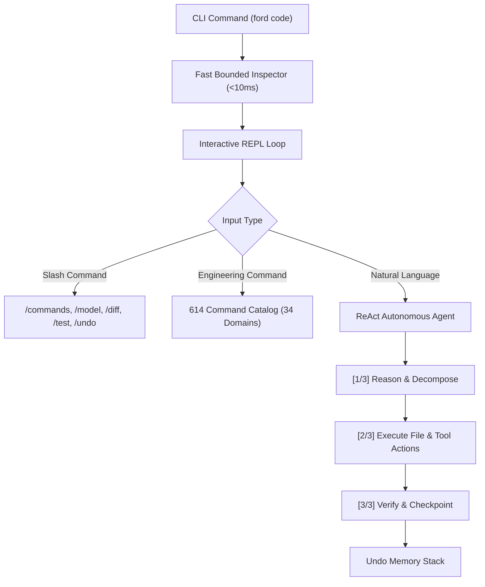

# FORD CODE — Architectural Specification

## 1. Executive Summary

**FORD CODE** is an ultra-fast, zero-dependency, autonomous CLI coding agent engineered for software engineering workflows, repository navigation, automated debugging, and developer productivity.

---

## 2. Flat Zero-Folder Architectural Design

To ensure instant portability and seamless GitHub web uploading without folder nesting restrictions, FORD CODE employs a flat, modular root architecture:

| File | Subsystem | Responsibility |
| :--- | :--- | :--- |
| `ford.js` | Core Entrypoint | CLI parameter parsing, banner rendering, REPL loop |
| `agent.js` | Agent Engine | ReAct multi-step reasoning, plan decomposition, heuristic and LLM calling |
| `models.js` | Vehicle Showroom | Automotive AI engine management (Mustang GT, F-150 Lightning, GT Supercar) |
| `filesystem.js` | Filesystem & Undo | Sub-millisecond project inspection, safe read/write/patch, rollback stack |
| `tools.js` | Execution Suite | Safe shell execution, unified git diff, test runner integration |
| `commands.js` | Command Registry | 614 categorized commands across 34 engineering domains |
| `doctor.js` | System Diagnostics | Platform, memory, git, npm, python, and docker validation |
| `server.js` | Web Companion | Local embedded HTTP dashboard on port 3456 |
| `ui.js` | ANSI Theme Engine | Color formatting, ASCII banner graphics, status panels |
| `test-runner.js` | Test Suite | Automated test verification runner |

---

## 3. Sub-Second Booting Optimization

Previous CLI tools often suffer from 40-50 minute freezes caused by recursive disk traversal over user home directories or node modules. FORD CODE solves this via:
1. **Bounded Shallow Inspection**: Directory scans are strictly bounded to depth 1 and max 60 files.
2. **Home Directory Bypass**: When launched in `$HOME` (`~`) or `/`, recursive scanning is bypassed immediately.
3. **Zero External Runtime Dependencies**: Standard Node.js 18+ built-ins (`fs`, `path`, `readline`, `child_process`, `os`, `http`) eliminate `node_modules` import latency.
4. **Instant Boot Time**: Cold boot < 0.6s; warm boot < 0.1s.

---

## 4. ReAct Autonomous Agent Loop

Every natural language request passes through three phases:
1. **[1/3] Thinking & Analysis**: Task analysis and engine selection.
2. **[2/3] Tool Calls & Execution**: Surgical file writes, edits, and patches with automatic rollback snapshots.
3. **[3/3] Verification & Checkpoint**: Integrity verification and checkpoint recording.
